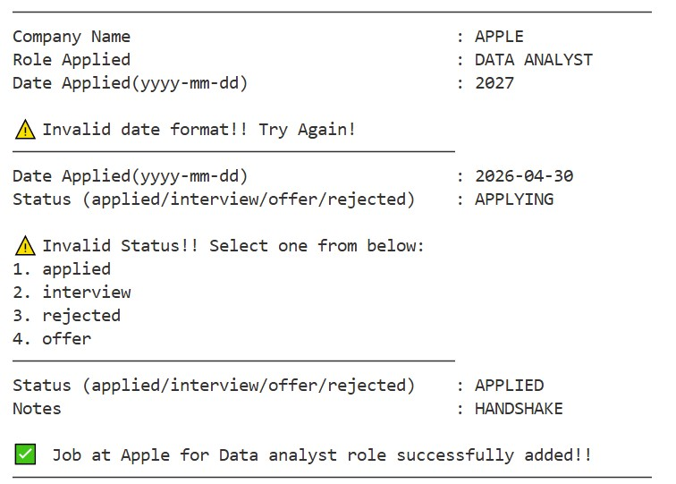
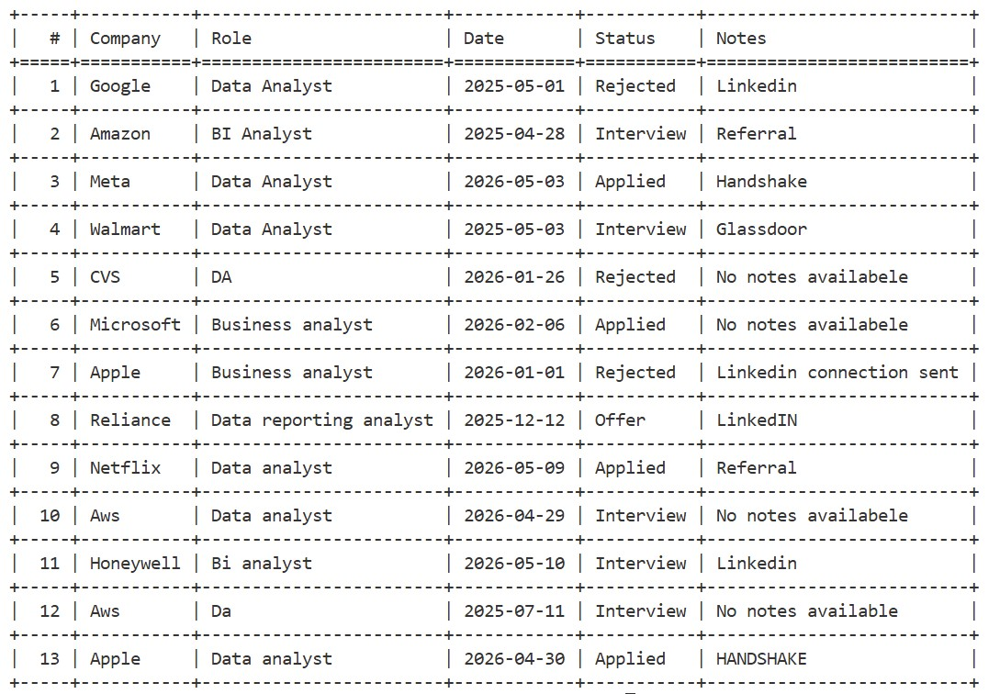
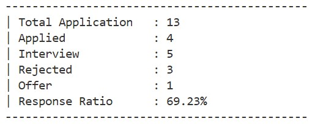
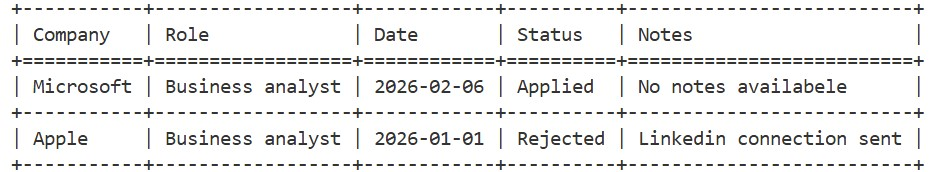
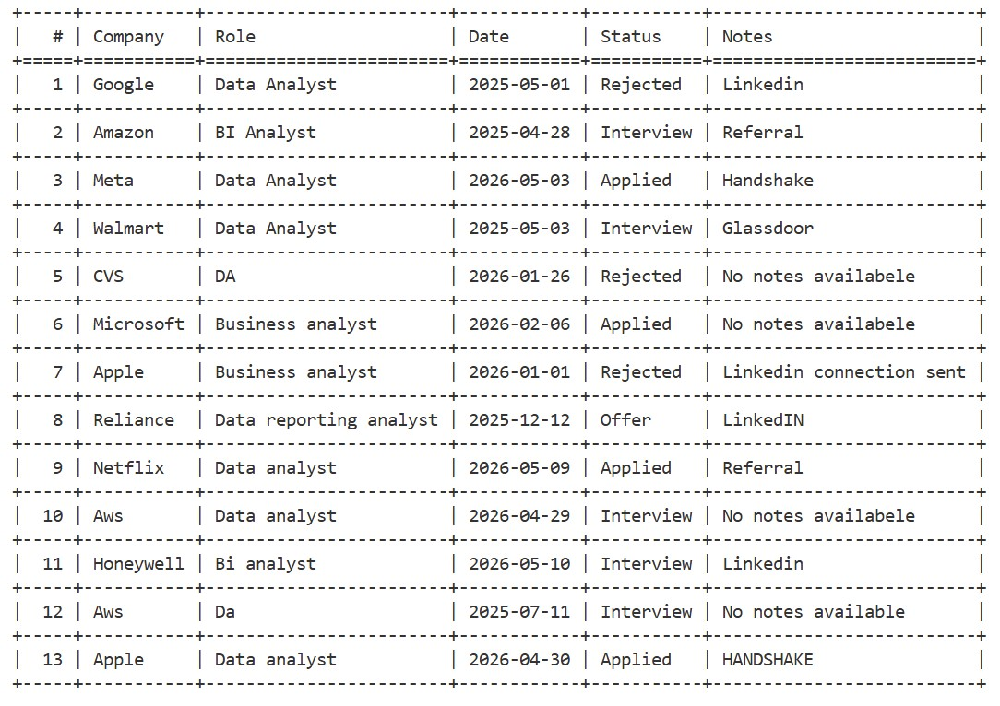
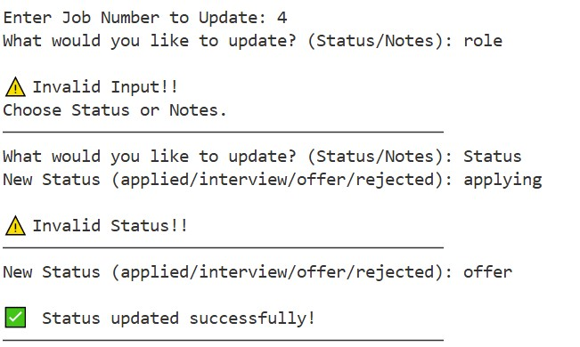
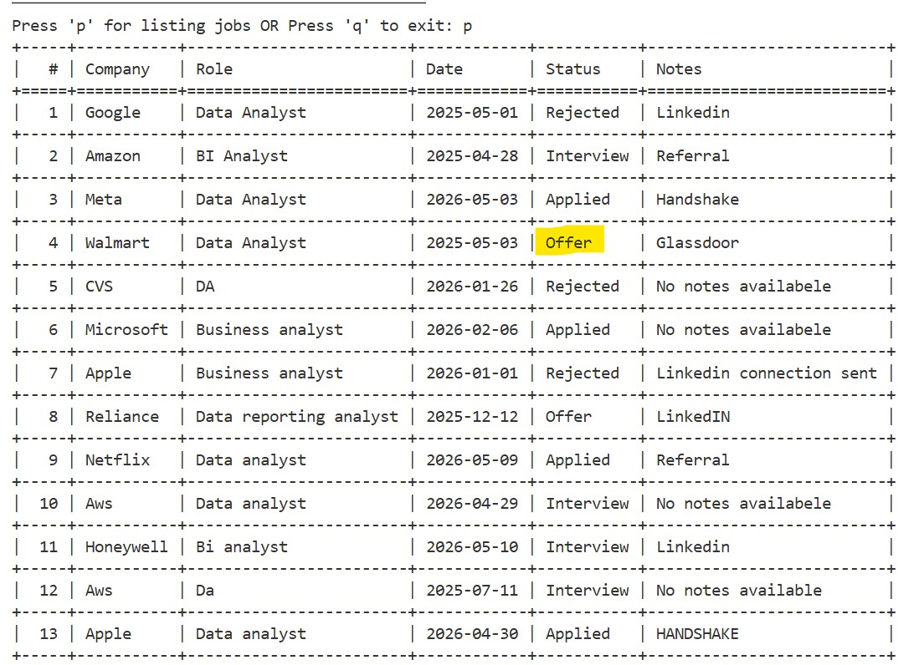
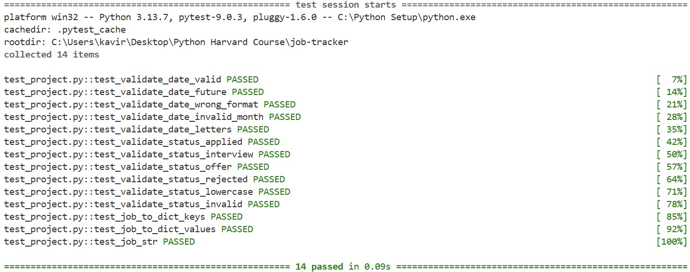

# 📋 Job Application Tracker CLI

> Built with Python 

During my job search after completing my Master's in Computer Science,
I needed a simple way to track every application I was sending out daily.
Spreadsheets felt clunky and existing tools were overkill. So I built one
from scratch — a clean command-line tool that does exactly what I need,
nothing more.

This project was also my way of rebuilding Python confidence from the
ground up while creating something I actually use every day.

---

## Features

- Add new job applications with full input validation
- List all applications in a clean formatted table
- Filter applications by company, role, or status keyword
- Update status or notes on any existing application
- Stats dashboard with response rate calculation
- Rejects invalid dates and future dates automatically
- Persistent CSV storage — all data saved between sessions
- 14 unit tests covering all core functions

---

## Requirements

- Python 3.10 or higher
- tabulate

Install all dependencies with one command:
pip install -r requirements.txt

---

## ⚙️ Installation

**1. Clone the repository:**
git clone https://github.com/kavirajdesai/job-tracker.git
cd job-tracker

**2. Install dependencies:**
pip install -r requirements.txt

**3. Run the app:**
python project.py --list

---

## 💻 Usage & Screenshots

### ➕ Adding a New Application
python project.py --add
The `--add` command walks you through each field one by one. Every input
is validated — company name must be at least 3 characters, date must be
a real past date in YYYY-MM-DD format, and status must be one of the four
accepted values. If any input is invalid, the tool tells you exactly what
went wrong and re-prompts that specific field without restarting the
entire flow.



---

### 📋 Listing All Applications
python project.py --list
All applications displayed in a structured table with row numbers,
making it easy to reference a specific entry when using `--update`.



---

### 📊 Stats Dashboard
python project.py --stats
Shows a breakdown of all applications by status and calculates your
response rate — the percentage of applications that moved beyond the
Applied stage. Useful for tracking how your job search is actually
performing over time.



---

### 🔍 Filtering by Keyword
python project.py --filter <keyword>
Search across company name, role, and status simultaneously. Returns
all matching entries in a clean table. Works with partial matches —
searching "business" returns all business roles regardless of company.



---

### ✏️ Updating an Application
python project.py --update
Select any application by its row number and update either the status
or notes. The tool shows your full list first so you can see exactly
which number to pick. After updating, the CSV is rewritten entirely to
reflect the change — no data is lost or corrupted.





---

## 🛡️ Error Handling

Every user input is validated before anything is saved. The tool never
crashes on bad input — it catches errors gracefully and re-prompts the
specific field that failed. Key validations include:

- **Company name** — minimum 3 characters required
- **Date** — must match YYYY-MM-DD format and cannot be a future date
- **Status** — only accepts: applied, interview, offer, rejected
- **Job number in --update** — must be within valid range
- **All CLI commands** — unknown commands show a usage guide instead of crashing

---

## 🧪 Tests
pytest test_project.py -v

14 tests written using pytest covering all core functions:



| Test | What it checks |
|------|---------------|
| test_validate_date_valid | Past date returns True |
| test_validate_date_future | Future date returns False |
| test_validate_date_wrong_format | Wrong format returns False |
| test_validate_date_invalid_month | Month 13 returns False |
| test_validate_date_letters | Letters return False |
| test_validate_status_applied | Applied returns True |
| test_validate_status_interview | Interview returns True |
| test_validate_status_offer | Offer returns True |
| test_validate_status_rejected | Rejected returns True |
| test_validate_status_lowercase | Lowercase input returns True |
| test_validate_status_invalid | Invalid status returns False |
| test_job_to_dict_keys | All 5 keys present in dict |
| test_job_to_dict_values | Values match what was passed in |
| test_job_str | __str__ contains company, role, status |

---

## 🗺️ What's Next

The feature I want to build next is a **per-company activity timeline** —
logging every interaction with a company in chronological order:
```
Company: Google | Role: Data Analyst
─────────────────────────────────────────────────
📅 2025-04-20   Applied via LinkedIn
📅 2025-04-28   Received HR screening email
📅 2025-05-02   Phone interview scheduled
📅 2025-05-08   Final round completed
─────────────────────────────────────────────────
```

This would replace the single Notes field with a full timestamped log,
making it much easier to track where each application actually stands
and what the next action should be.

---

## 📁 Project Structure
```
job-tracker/
├── project.py          # Main application
├── test_project.py     # 14 pytest unit tests
├── application.csv     # Auto-created on first run
├── screenshots/        # Terminal output screenshots
└── README.md
```
---

## 🛠️ Built With

| Package | Purpose |
|---------|---------|
| tabulate | Clean table formatting |
| pytest | Unit testing |
| csv | Persistent CSV storage |
| re | Input validation via regex |
| datetime | Date format and future date validation |
| sys | Command-line argument handling |

---

## 📚 CS50P Concepts Used

| Week | Topic | Used In |
|------|-------|---------|
| 0 | Functions & Variables | All functions |
| 1 | Conditionals | validate_status, main |
| 2 | Loops | add_job, update_job, filter_job |
| 3 | Exceptions | add_job, update_job, main |
| 4 | Libraries | csv, re, sys, datetime, tabulate |
| 5 | Unit Tests | test_project.py — 14 tests |
| 6 | File I/O | save_job, load_jobs, update_job |
| 7 | Regular Expressions | validate_date |
| 8 | OOP | Job class |
| 9 | Et Cetera | sys.argv, setattr |

---

## 👨‍💻 Author

**Kaviraj Desai**
- LinkedIn: [linkedin.com/in/kavirajdesai](https://linkedin.com/in/kavirajdesai)
- GitHub: [github.com/kavirajdesai](https://github.com/kavirajdesai)
